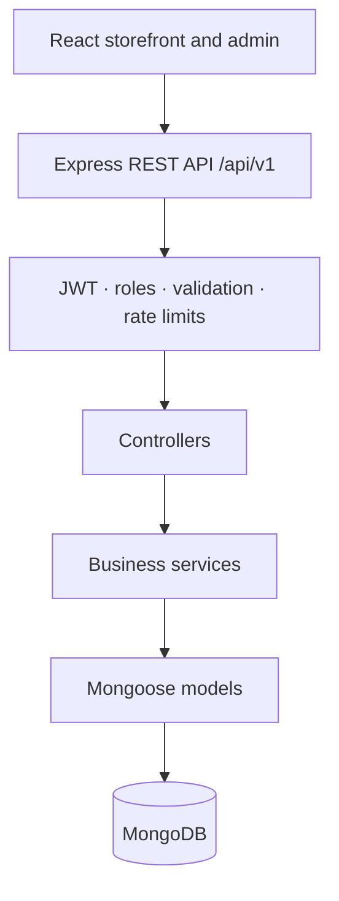
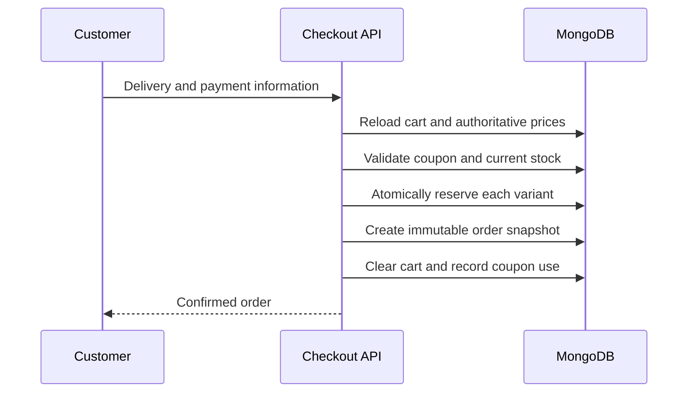

<div align="center">

# ToQa

### A complete single-store e-commerce platform for modest clothing

Browse thoughtful collections, select size and colour variants, shop as a guest or customer, and manage the entire store from a secure admin workspace.

[](https://github.com/Ubs-MA/ToQa/actions/workflows/backend-ci.yml)


**Node.js Bootcamp Final Project · August 2026**

</div>

---

## Overview

ToQa helps a modest-clothing retailer move from informal social-media selling to a structured online store. It provides a responsive customer storefront, variant-aware inventory, a stock-safe checkout flow, and a role-protected admin workspace.

The system is deliberately designed as a **single-store platform**, not a marketplace. Product prices, discounts, availability, stock deductions, and order totals are always validated by the backend.

## Highlights

- Guest and registered-customer shopping flows
- JWT authentication with customer and admin roles
- Product variants based on size and colour
- Accurate stock tracking per variant
- Search, filtering, sorting, and backend pagination
- Guest carts identified by a safe session ID
- Cash on Delivery and Electronic Wallet records
- Percentage and fixed-value coupons
- Customer order history and status tracking
- Wishlist and purchased-product reviews
- Secure product-image uploads
- Admin dashboard and operational management pages
- Swagger/OpenAPI, Postman, Docker, Jest, and GitHub Actions

## Application Features

### Customer storefront

| Area | Capabilities |
| --- | --- |
| Authentication | Register, login, logout, persistent session, protected pages |
| Profile | View and update personal, phone, address, and governorate information |
| Catalog | Product listing, details, categories, variants, availability, sorting |
| Discovery | Search by name; filter by category, price, size, colour, and stock |
| Cart | Add, update, remove, clear, apply/remove coupon, server-calculated totals |
| Checkout | Guest or customer checkout, delivery details, notes, payment selection |
| Orders | History, details, status tracking, eligible cancellation |
| Wishlist | Add/remove products and move an available product to the cart |
| Reviews | Rating and comment after a delivered purchase |

### Admin workspace

| Area | Capabilities |
| --- | --- |
| Dashboard | Order count, active products, low stock, paid sales, recent orders |
| Catalog | Create, edit, deactivate, and upload images for products |
| Variants | Manage size, colour, SKU, price, activation, and stock |
| Taxonomy | Manage categories, sizes, and colours |
| Inventory | View low/out-of-stock variants and update quantities |
| Orders | Search orders and update order/payment status |
| Coupons | Create, edit, validate, track usage, and deactivate coupons |
| Customers | Search users and activate/deactivate accounts |
| Reviews | View and remove inappropriate reviews |

## Architecture



The backend uses a conventional layered structure:

- **Routes** define endpoints and middleware order.
- **Controllers** translate HTTP requests and responses.
- **Services** enforce stock, cart, coupon, order, and review rules.
- **Models** define persistent data and database constraints.
- **Middleware** handles authentication, roles, validation, uploads, logging, and errors.

## Checkout and Stock Safety



If an item cannot be reserved or order creation fails, previously reserved quantities are restored. Cancelling an eligible order also restores its stock.

## Technology Stack

| Layer | Technologies |
| --- | --- |
| Frontend | React, Vite, React Router, Lucide React, responsive CSS |
| Backend | Node.js 22, Express 5, CommonJS |
| Database | MongoDB, Mongoose |
| Authentication | JWT, bcryptjs, HTTP-only cookie support |
| Validation and security | express-validator, Helmet, CORS, rate limiting, Multer |
| Logging | Winston, Morgan |
| Documentation | Swagger UI, OpenAPI YAML, Postman |
| Testing | Jest, Supertest |
| Delivery | Docker Compose, GitHub Actions |

## Repository Structure

```text
ToQa/
├── backend/
│   ├── src/
│   │   ├── config/
│   │   ├── constants/
│   │   ├── controllers/
│   │   ├── docs/
│   │   ├── middlewares/
│   │   ├── models/
│   │   ├── routes/
│   │   ├── scripts/
│   │   ├── services/
│   │   ├── utils/
│   │   └── validators/
│   ├── tests/
│   └── uploads/
├── frontend/
│   └── src/
│       ├── components/
│       └── pages/
├── docs/
│   └── postman/
├── .github/
└── docker-compose.yml
```

## Getting Started

### Prerequisites

- Node.js 20 or newer; Node.js 22 is recommended
- npm 10 or newer
- MongoDB Atlas connection or a local MongoDB instance
- Git

### 1. Clone the repository

```bash
git clone https://github.com/Ubs-MA/ToQa.git
cd ToQa
```

### 2. Configure the backend

```bash
cd backend
cp .env.example .env
npm ci
```

Update `backend/.env`:

```env
NODE_ENV=development
PORT=5000
MONGODB_URI=mongodb://127.0.0.1:27017/toqa
JWT_SECRET=replace-with-a-long-random-secret
JWT_EXPIRES_IN=7d
LOW_STOCK_THRESHOLD=5
LOG_LEVEL=info
CLIENT_ORIGIN=http://localhost:5173
ADMIN_SEED_EMAIL=admin@toqa.local
ADMIN_SEED_PASSWORD=choose-a-strong-password
```

Generate a secure JWT secret locally:

```bash
node -e "console.log(require('crypto').randomBytes(64).toString('hex'))"
```

> Never commit `backend/.env` or share its MongoDB URI and JWT secret.

### 3. Seed an admin and demonstration product

```bash
npm run seed
```

The seed is safe to run more than once: it updates or creates the configured admin and demonstration records without deleting the database.

### 4. Start the backend

```bash
npm run dev
```

Backend services:

- API: `http://localhost:5000/api/v1`
- Health check: `http://localhost:5000/api/v1/health`
- Swagger UI: `http://localhost:5000/api-docs`

### 5. Configure and start the frontend

Open a second terminal:

```bash
cd frontend
cp .env.example .env
npm ci
npm run dev
```

Open `http://localhost:5173`.

## Available Scripts

### Backend

| Command | Purpose |
| --- | --- |
| `npm run dev` | Start the API with nodemon |
| `npm start` | Start the API normally |
| `npm test` | Run the complete Jest test suite |
| `npm run test:watch` | Run tests in watch mode |
| `npm run test:coverage` | Generate a coverage report |
| `npm run seed` | Upsert the admin and demonstration catalog data |

### Frontend

| Command | Purpose |
| --- | --- |
| `npm run dev` | Start the Vite development server |
| `npm run build` | Create a production build |
| `npm run preview` | Preview the production build locally |

## API Overview

All application endpoints are versioned under `/api/v1`.

| Prefix | Purpose |
| --- | --- |
| `/auth` | Registration, login, logout, current user |
| `/users` | Customer profile and password |
| `/categories` | Public category browsing |
| `/products` | Search, filters, details, variants, reviews |
| `/cart` | Guest/customer cart and coupon application |
| `/checkout` | Final validation and order creation |
| `/orders` | Customer order history, details, cancellation |
| `/wishlist` | Authenticated wishlist |
| `/reviews` | Customer review update/removal |
| `/coupons` | Public coupon validation |
| `/uploads` | Protected product-image upload |
| `/admin` | Dashboard and store-management APIs |

Protected requests accept:

```http
Authorization: Bearer <token>
```

Guest carts use the `x-session-id` header. The API returns the header when it creates a new guest session.

## Testing and Quality

Run the backend suite:

```bash
cd backend
npm test
```

Validate the frontend production bundle:

```bash
cd frontend
npm run build
```

The repository also includes:

- A GitHub Actions backend CI workflow
- An importable Postman collection
- Swagger UI generated from OpenAPI YAML
- A manual regression and release checklist
- Dependency and credential-safety checks

## Run with Docker

From the repository root:

```bash
docker compose up --build
```

This starts MongoDB, the backend, and the frontend. For anything beyond local development, provide a strong `JWT_SECRET` through the environment rather than relying on the Compose fallback.

## Documentation

- [Backend guide](backend/README.md)
- [Architecture](docs/ARCHITECTURE.md)
- [Business rules](docs/BUSINESS-RULES.md)
- [QA checklist](docs/QA-CHECKLIST.md)
- [Git workflow](docs/GIT-WORKFLOW.md)
- [Postman collection](docs/postman/ToQa.postman_collection.json)

## Git Workflow

```text
feature/* ──► develop ──► main
   fixes         QA       release
```

- Develop features on isolated branches.
- Open pull requests into `develop`.
- Require review and passing CI.
- Merge only stable, trainer-ready releases into `main`.
- Never force-push a shared branch or commit real secrets.

## Project Scope

ToQa intentionally excludes multi-vendor marketplace logic, real payment gateways, carrier integrations, microservices, and advanced business intelligence. Electronic Wallet is stored as a simple reference-based business flow; no external payment transaction is performed.

---

<div align="center">

Built by a team of six trainees as a Node.js Bootcamp final project.

**ToQa — quiet confidence, beautifully worn.**

</div>
