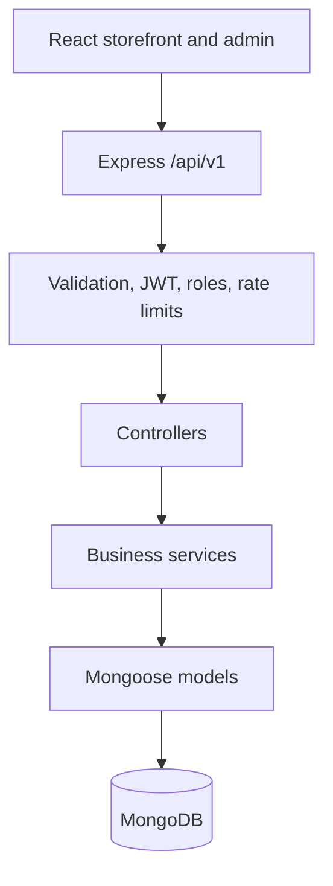
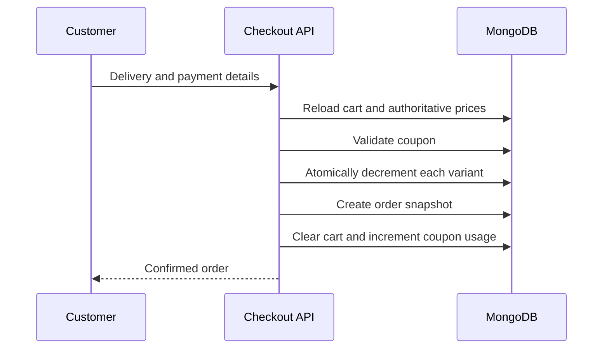

# Architecture

ToQa uses a conventional layered monolith. The storefront and admin workspace share one React application and one versioned REST API.

Controllers translate HTTP input and output. Services own totals, coupon rules, stock reservation, authorization-sensitive queries, and order transitions. Models enforce persistence constraints. Cross-cutting middleware handles authentication, authorization, validation, uploads, logging, not-found responses, and centralized errors.

## Checkout sequence

If any stock reservation or order creation step fails, already-reserved quantities are restored. Customer and admin cancellation also restores stock exactly once.

## Security boundaries

- Customer and admin identity comes only from a verified JWT.
- `/admin/*` requires both authentication and the `admin` role.
- Password hashes are excluded from normal Mongoose queries.
- Uploaded images are limited to JPEG, PNG, or WebP and 5 MB.
- The API never accepts cart totals or authoritative prices from the client.
- Secrets are loaded from environment variables and excluded from Git.
